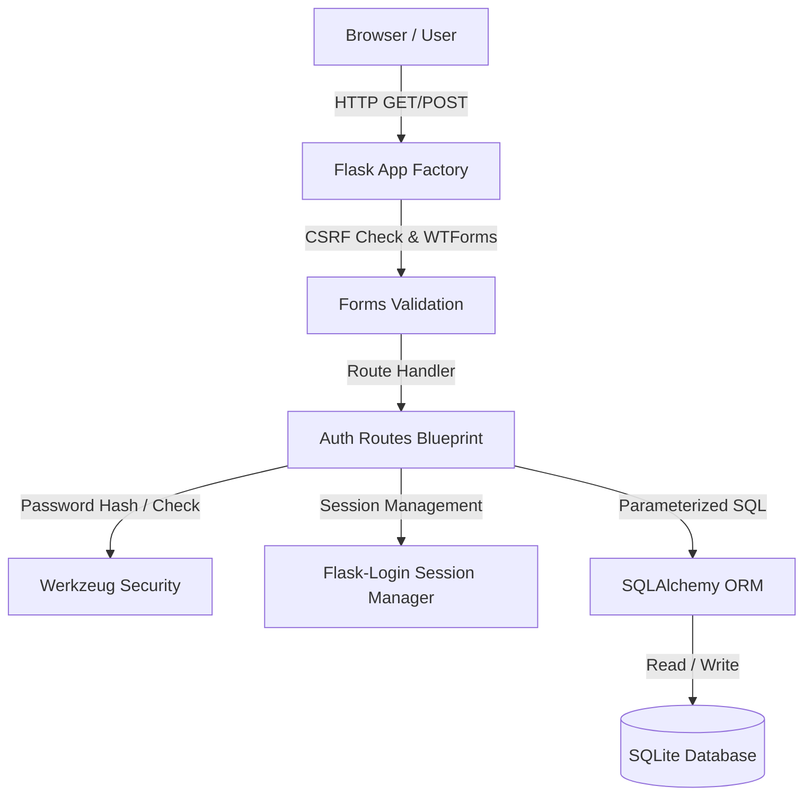

# AuthVault — User Login & Authentication System 🔐


A production-grade, secure **User Authentication & Session Management System** built with **Python (Flask)**, **SQLite**, **SQLAlchemy**, and modern **HTML5/Vanilla CSS/JS**.

Designed to showcase clean web application architecture, modern security practices (password salted hashing, CSRF tokens, ORM query parameterization), automated testing, and web development fundamentals for technical interviews and GitHub portfolios.

---

## 🌟 Key Features

- 👤 **User Registration & Validation**: Email & username uniqueness validation, alphanumeric rules, password confirmation, and input sanitization.
- 🔑 **Secure Authentication**: Username/Email dual-identifier sign-in powered by `Flask-Login` and `Werkzeug.security`.
- 🛡️ **Salted Password Hashing**: Passwords stored using standard one-way salted hashes (`scrypt` / `pbkdf2:sha256`). Plaintext passwords never hit the database.
- 🔒 **Protected Routes**: Custom `@login_required` authorization decorators guarding user dashboards and settings.
- 🍪 **Session Management & Cookie Security**: Session persistence with `HttpOnly` and `SameSite=Lax` cookies to prevent XSS session theft.
- 🛡️ **CSRF Protection**: Form token validation using `Flask-WTF` to block Cross-Site Request Forgery attacks.
- ⚙️ **User Profile Management**: Password update form with current password verification.
- 🧪 **Automated Test Suite**: 100% passing unit tests using `pytest` covering auth logic, database operations, and route security.
- 🎨 **Modern Dark UI**: Responsive glassmorphic layout with micro-animations and eye-icon password toggles.

---

## 🏗️ System Architecture



---

## 📁 Folder Structure

```
user-login-system/
├── app/
│   ├── __init__.py          # App initialization & extension setup
│   ├── models.py            # User database model (id, username, email, password_hash, created_at)
│   ├── routes.py            # Route handlers (auth, dashboard, profile)
│   ├── forms.py             # Form validation & security rules
│   ├── static/
│   │   ├── css/style.css    # Modern glassmorphism CSS design system
│   │   └── js/main.js       # Toast notifications & UI password toggles
│   └── templates/
│       ├── base.html        # Base layout with navbar & flash alerts
│       ├── index.html       # Landing page
│       ├── login.html       # Login page
│       ├── register.html    # User registration page
│       ├── dashboard.html   # Protected user home page
│       └── profile.html     # User profile & password update page
├── tests/
│   ├── conftest.py          # Pytest setup & test client fixtures
│   └── test_auth.py        # Automated unit tests
├── config.py               # Environment configuration (Secret key, DB path)
├── run.py                  # Server entry point
├── requirements.txt        # Project dependencies list
├── .env.example             # Environment variables template
├── .gitignore               # Exclude virtual environment, DB file, secrets
└── README.md                # Comprehensive documentation & interview guide
```

---

## 🚀 Quickstart Guide

### 1. Prerequisites
- Python 3.10+ installed on your system.
- Git.

### 2. Installation Steps

```bash
# Clone the repository
git clone https://github.com/your-username/user-login-system.git
cd user-login-system

# Create a virtual environment
python -m venv venv

# Activate virtual environment
# On Windows:
.\venv\Scripts\activate
# On macOS/Linux:
source venv/bin/activate

# Install dependencies
pip install -r requirements.txt
```

### 3. Run Development Server

```bash
python run.py
```

Open your browser and navigate to `http://127.0.0.1:5000`.

---

## 🧪 Running Unit Tests

Execute the automated pytest suite to verify all authentication flows:

```bash
pytest -v
```

Expected output:
```text
tests/test_auth.py::test_user_password_hashing PASSED                    [ 14%]
tests/test_auth.py::test_user_registration_success PASSED                [ 28%]
tests/test_auth.py::test_user_registration_duplicate_username PASSED     [ 42%]
tests/test_auth.py::test_user_login_success PASSED                       [ 57%]
tests/test_auth.py::test_user_login_invalid_password PASSED              [ 71%]
tests/test_auth.py::test_unauthorized_route_access PASSED                [ 85%]
tests/test_logout PASSED                                                 [100%]

============================== 7 passed in 3.22s ==============================
```

---

## 💡 Technical Interview Q&A Guide

When explaining this project in a software engineering interview, use these structured answers:

### 1. How does password hashing work in this application, and why not encrypt passwords?
> **Answer**: We use one-way cryptographic salted hashing via `Werkzeug.security` (`scrypt` / `pbkdf2:sha256`). Encryption is two-way (reversible with a key), meaning if a key is leaked, attacker can read all passwords. One-way hashing cannot be reversed. Salting adds unique random data to each password before hashing, preventing rainbow table attacks.

### 2. How does your app prevent SQL Injection vulnerabilities?
> **Answer**: All database interactions use **SQLAlchemy ORM**, which uses parameterized queries (prepared statements). Instead of concatenating raw user input strings into SQL code, input is passed as parameters, making it impossible for user input to alter the executable SQL logic.

### 3. What is Cross-Site Request Forgery (CSRF) and how is it mitigated here?
> **Answer**: CSRF occurs when a malicious site tricks a user's browser into sending unauthorized requests to a site where they are logged in. We mitigate this using `Flask-WTF`, which injects a unique, cryptographically signed CSRF token into every form (`{{ form.csrf_token }}`). The server verifies this token on POST requests.

### 4. How do cookie flags like `HttpOnly` and `SameSite` improve session security?
> **Answer**: 
> - `HttpOnly` prevents client-side JavaScript (e.g. injected XSS scripts) from accessing `document.cookie`, safeguarding the session cookie.
> - `SameSite=Lax` prevents the browser from sending session cookies on cross-site requests, blocking CSRF attacks on GET/POST state modifications.

### 5. How does the `@login_required` decorator function?
> **Answer**: Provided by `Flask-Login`, `@login_required` checks if `current_user.is_authenticated` is `True`. If false, it interrupts the request, flashes an informational message, and redirects the client to the `/login` route with a `next` parameter preserving the target URL.

---

## 📄 License
This project is open-source under the [MIT License](LICENSE).
